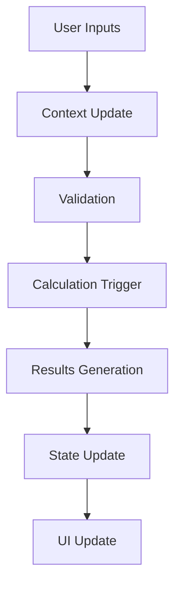

# Calculator Engines

## Overview

The Calculator Engines are the core computational systems powering PropInfera's investment analysis capabilities. These engines process user inputs to generate detailed financial metrics and projections, enabling informed real estate investment decisions.

### Purpose
- Provide accurate investment calculations
- Generate comprehensive financial metrics
- Enable data-driven investment decisions
- Support multiple investment strategies

### Core Calculators
1. Rental Calculator
   - Traditional rental property analysis
   - Long-term investment metrics
   - Cash flow projections

2. Airbnb Calculator
   - Short-term rental analysis
   - Seasonal adjustments
   - Platform fee modeling

3. Wholesale Calculator
   - Assignment fee calculations
   - Quick flip analysis
   - Profit projections

4. Mortgage Calculator
   - Loan amortization
   - PITI calculations
   - Tax and insurance integration

## Architecture

### Frontend Layer
**File:** `/components/calculators/`

#### Components
1. `RentersCalculator.tsx`
   - Input form
   - Results display
   - Projection charts

2. `AirbnbCalculator.tsx`
   - Seasonal inputs
   - Platform settings
   - Income projections

3. `WholesaleCalculator.tsx`
   - MAO calculation
   - Profit analysis
   - Quick metrics

4. `MortgageCalculator.tsx`
   - Loan inputs
   - Payment breakdown
   - Tax integration

### Protocol Layer
**File:** `/lib/models/analysisModel.ts`

#### Calculation Functions
```typescript
// Rental Analysis
calculateRentalMetrics(inputs: RentalInputs): RentalResults {
  // Cash flow calculations
  // ROI projections
  // Cap rate analysis
}

// Airbnb Analysis
calculateAirbnbMetrics(inputs: AirbnbInputs): AirbnbResults {
  // Income projections
  // Seasonal adjustments
  // Platform fee calculations
}

// Wholesale Analysis
calculateWholesaleMetrics(inputs: WholesaleInputs): WholesaleResults {
  // MAO calculation
  // Profit analysis
  // ROI projections
}

// Mortgage Analysis
calculateMortgageMetrics(inputs: MortgageInputs): MortgageResults {
  // PITI calculations
  // Amortization schedule
  // Tax integration
}
```

### Context Layer
**File:** `/context/AnalysisContext.tsx`

#### State Management
```typescript
interface AnalysisState {
  inputs: CalculatorInputs;
  results: CalculatorResults;
  isLoading: boolean;
  error: string | null;
}

interface AnalysisContextType {
  state: AnalysisState;
  updateInputs: (inputs: Partial<CalculatorInputs>) => void;
  calculateResults: () => Promise<void>;
  resetCalculator: () => void;
}
```

## Features

### Rental Calculator
#### Metrics
1. Monthly Cash Flow
   - Gross income
   - Operating expenses
   - Net cash flow

2. Annual ROI
   - Cash-on-cash return
   - Total return
   - Equity growth

3. Key Ratios
   - Cap rate
   - Cash-on-cash
   - Debt coverage ratio

4. Projections
   - 5-year cash flow
   - Equity growth
   - Property value

### Airbnb Calculator
#### Features
1. Income Modeling
   - Base nightly rate
   - Occupancy projections
   - Seasonal adjustments

2. Expense Analysis
   - Cleaning fees
   - Platform fees
   - Maintenance costs

3. Performance Metrics
   - Average daily rate
   - Occupancy rate
   - Revenue per available room

### Wholesale Calculator
#### Calculations
1. Maximum Allowable Offer
   - After repair value
   - Repair costs
   - Desired profit

2. Profit Analysis
   - Assignment fee
   - Holding costs
   - Net profit

3. Return Metrics
   - Cash-on-cash return
   - ROI
   - Profit margin

### Mortgage Calculator
#### Components
1. Loan Analysis
   - Principal and interest
   - Amortization schedule
   - Total interest paid

2. PITI Calculation
   - Principal
   - Interest
   - Taxes
   - Insurance

3. Tax Benefits
   - Interest deduction
   - Property tax deduction
   - Depreciation

## Data Flow

### Input Processing


### State Management
1. Input Changes
   - Debounced updates
   - Validation checks
   - Context updates

2. Calculation Trigger
   - Pure functions
   - Error handling
   - Result formatting

3. Results Display
   - Dynamic updates
   - Formatting
   - Error states

## Error Handling

### Input Validation
```typescript
interface ValidationRules {
  purchasePrice: {
    min: number;
    max: number;
    required: boolean;
  };
  downPayment: {
    min: number;
    max: number;
    required: boolean;
  };
  // ... other fields
}
```

### Error Types
| Error Type | Handling |
|------------|----------|
| Invalid Input | Show error message |
| Calculation Error | Display fallback |
| State Error | Reset calculator |

## Optimization

### Performance
1. Memoization
   ```typescript
   const calculateResults = useMemo(() => {
     return heavyCalculation(inputs);
   }, [inputs]);
   ```

2. Batching
   ```typescript
   const updateMultipleInputs = (updates: Partial<CalculatorInputs>) => {
     batch(() => {
       // Multiple state updates
     });
   };
   ```

3. Debouncing
   ```typescript
   const debouncedUpdate = useDebouncedCallback(
     (value: string) => {
       updateInput(value);
     },
     300
   );
   ```

## Future Enhancements

### AI Integration
1. Smart Recommendations
   - Input suggestions
   - Risk analysis
   - Market comparisons

2. Advanced Modeling
   - Property tax projections
   - Rent growth modeling
   - Market trend analysis

### Visualization
1. Charts
   - Cash flow graphs
   - ROI projections
   - Equity growth

2. Comparisons
   - Multi-property analysis
   - Scenario modeling
   - Market benchmarks

## Development Guidelines

### Best Practices
1. Code Organization
   - Keep calculations pure
   - Centralize business logic
   - Modularize components

2. Type Safety
   ```typescript
   interface CalculatorInputs {
     purchasePrice: number;
     downPayment: number;
     // ... other fields
   }

   interface CalculatorResults {
     monthlyCashFlow: number;
     annualROI: number;
     // ... other metrics
   }
   ```

3. Testing
   - Unit tests for calculations
   - Integration tests for flows
   - E2E tests for scenarios

### Performance
1. Optimization
   - Memoize heavy calculations
   - Batch state updates
   - Lazy load components

2. Monitoring
   - Calculation times
   - Memory usage
   - Render performance 