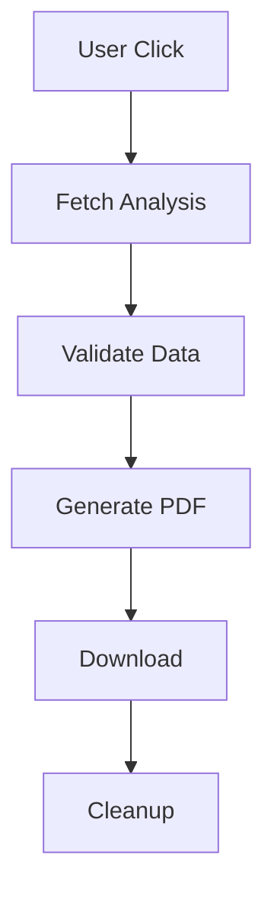

# PDF Export System

## Overview

The PDF Export System enables users to generate professional, downloadable reports of their property investment analyses. This document provides a comprehensive technical overview of the system's architecture, implementation, and usage patterns.

### Purpose
- Generate professional investment reports
- Enable offline analysis review
- Facilitate sharing of investment details
- Provide standardized documentation

### Value Proposition
1. For Users
   - Professional documentation
   - Offline access to analyses
   - Easy sharing with stakeholders
   - Standardized reporting format

2. For Business
   - Enhanced user experience
   - Professional brand representation
   - Data portability
   - Future monetization potential

### Supported Pages
- Analysis Detail Page (`/dashboard/saved/[id]`)
- Calculator Results Page (`/renters`, `/airbnb`, etc.)
- Future: Custom report generation

## Architecture

### Protocol Layer
**File:** `/lib/pdf/exportAnalysisToPDF.ts`

#### Core Function
```typescript
interface ExportOptions {
  includeInsights?: boolean;
  watermark?: boolean;
  template?: 'standard' | 'premium';
}

async function exportAnalysisToPDF(
  analysis: Analysis,
  options?: ExportOptions
): Promise<Uint8Array> {
  // PDF generation logic
}
```

#### PDF Structure
1. Cover Page
   - Property details
   - Analysis metadata
   - Generation timestamp

2. Inputs Section
   - Property information
   - Financial assumptions
   - Investment parameters

3. Results Section
   - Key metrics
   - Performance indicators
   - Projections

4. Insights Section (Optional)
   - GPT-generated insights
   - Investment recommendations

### Frontend Layer
**File:** `/components/dashboard/ExportPDFButton.tsx`

#### Component Implementation
```typescript
interface ExportPDFButtonProps {
  analysis: Analysis;
  onExportStart?: () => void;
  onExportComplete?: () => void;
  onError?: (error: Error) => void;
}

const ExportPDFButton: React.FC<ExportPDFButtonProps> = ({
  analysis,
  onExportStart,
  onExportComplete,
  onError
}) => {
  // Button implementation
};
```

#### Features
- Loading state handling
- Error state display
- Success feedback
- Dynamic import of PDF library

## Features

### Report Generation
1. Property Details
   ```typescript
   interface PropertyDetails {
     name: string;
     address: string;
     type: AnalysisType;
     createdAt: string;
   }
   ```

2. Investment Assumptions
   ```typescript
   interface InvestmentInputs {
     purchasePrice: number;
     downPayment: number;
     interestRate: number;
     // ... other inputs
   }
   ```

3. Investment Results
   ```typescript
   interface InvestmentResults {
     monthlyCashFlow: number;
     annualROI: number;
     capRate: number;
     // ... other metrics
   }
   ```

### Formatting
1. Typography
   - Headers: 16pt bold
   - Body: 12pt regular
   - Metrics: 14pt semibold

2. Layout
   - Margins: 1 inch
   - Section spacing: 0.5 inch
   - Grid alignment

3. Styling
   - Brand colors
   - Consistent spacing
   - Professional fonts

## Data Flow

### Generation Process


### State Management
1. Export Initiation
   - Button click handler
   - Loading state
   - Error handling

2. PDF Generation
   - Dynamic import
   - Progress tracking
   - Memory management

3. Download
   - Browser compatibility
   - File naming
   - Error recovery

## Error Handling

### Validation
```typescript
function validateAnalysisForExport(analysis: Analysis): boolean {
  // Check required fields
  // Validate data types
  // Ensure completeness
}
```

### Error Types
| Error Type | Handling |
|------------|----------|
| Invalid Data | Show error + retry |
| Generation Failed | Display toast + log |
| Download Failed | Show instructions |

## Optimization

### Performance
1. Dynamic Import
   ```typescript
   const generatePDF = async () => {
     const { exportAnalysisToPDF } = await import('@/lib/pdf/exportAnalysisToPDF');
     // Use imported function
   };
   ```

2. Memoization
   ```typescript
   const memoizedTemplate = useMemo(() => {
     return generateTemplate(analysis);
   }, [analysis]);
   ```

3. Batching
   ```typescript
   const batchWrites = (doc: PDFDocument, sections: Section[]) => {
     // Batch PDF operations
   };
   ```

## Future Enhancements

### Features
1. Customization
   - Section selection
   - Template options
   - Branding settings

2. Preview
   - Modal preview
   - Page navigation
   - Zoom controls

3. History
   - Export logs
   - Download tracking
   - Usage analytics

### Technical
1. Performance
   - Web Worker support
   - Streaming generation
   - Caching strategies

2. Security
   - Watermarking
   - Encryption
   - Access control

## Development Guidelines

### Best Practices
1. Code Organization
   - Modular templates
   - Reusable components
   - Clear separation of concerns

2. Type Safety
   ```typescript
   interface PDFTemplate {
     sections: Section[];
     styles: StyleConfig;
     metadata: TemplateMetadata;
   }
   ```

3. Testing
   - Unit tests for generation
   - Integration tests for flow
   - E2E tests for export

### Performance
1. Optimization
   - Lazy loading
   - Memory management
   - Resource cleanup

2. Monitoring
   - Generation times
   - Memory usage
   - Error rates 