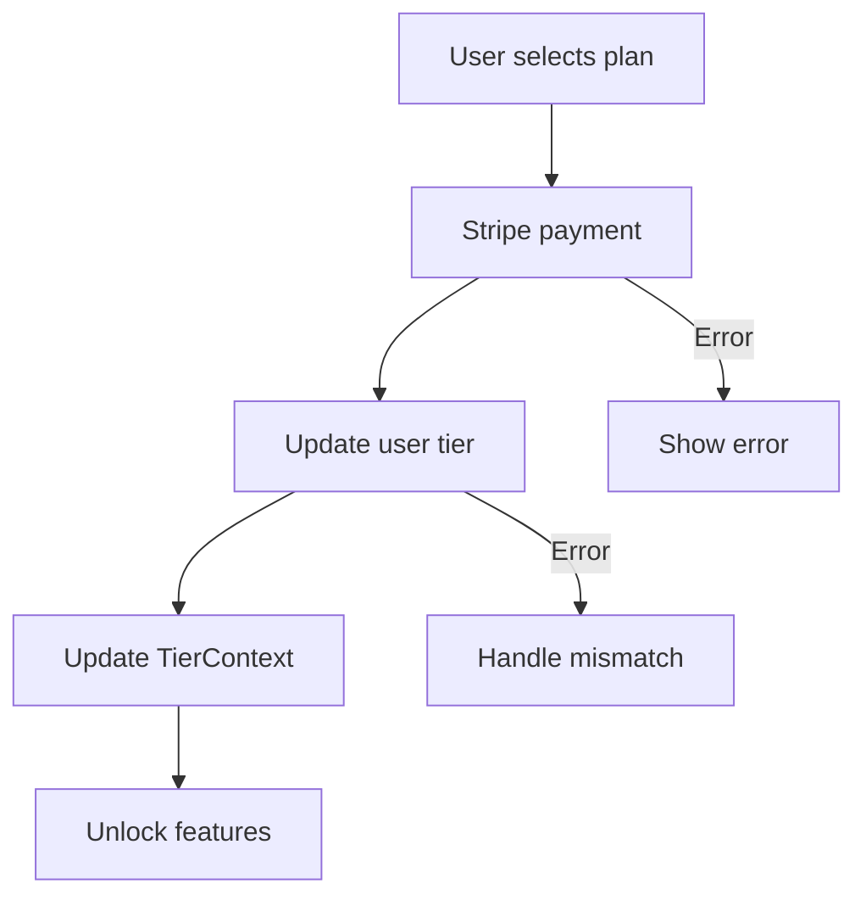
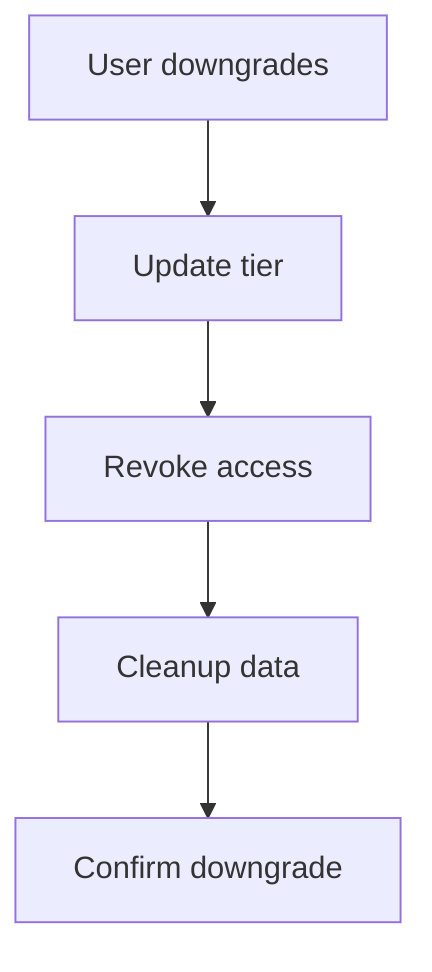

# Pricing & Tier Management System

## Overview

The Pricing & Tier Management System controls user access to PropInfera's features through a tiered subscription model, implementing business rules and technical controls for feature access and monetization.

### Purpose
- Monetize premium features
- Control feature access
- Enable business growth
- Provide clear upgrade paths

### User Segmentation
1. Free Tier
   - Entry-level access
   - Basic features
   - Limited usage

2. Pro Tier
   - Advanced features
   - Increased limits
   - Priority support

3. Elite Tier
   - Full feature access
   - Unlimited usage
   - Premium support

### Business Rules
- Feature access tied to tier
- Usage limits per tier
- Upgrade/downgrade flexibility
- Clear value proposition per tier

## Pricing Tiers

### Tier Structure
| Tier | Monthly | Yearly | Savings |
|------|---------|--------|----------|
| Free | $0 | $0 | - |
| Pro | $9 | $59 | 45% |
| Elite | $15 | $139 | 23% |

### Feature Access
| Feature | Free | Pro | Elite |
|---------|------|-----|-------|
| Smart URL Import | ✅ | ✅ | ✅ |
| Automated Property Calculation | ✅ | ✅ | ✅ |
| Market Analysis Tools | ❌ | ✅ | ✅ |
| AI-Powered Smart Analysis | ❌ | ✅ | ✅ |
| Priority Support | ❌ | ✅ | ✅ |
| Dedicated Expert Guidance | ❌ | ❌ | ✅ |
| Full AI Investment Analysis | ❌ | ❌ | ✅ |
| AI Agent Automation | ❌ | ❌ | ✅ |
| Custom Reports | ❌ | ❌ | ✅ |
| API Access | ❌ | ❌ | ✅ |
| Property Save Limit | 1 | 5 | Unlimited |

## User Tier Management

### Context Layer
**File:** `/context/TierContext.tsx`

#### Implementation
```typescript
interface TierContextType {
  tier: UserTier;
  isPro: boolean;
  isElite: boolean;
  canUseFeature: (feature: FeatureKey) => boolean;
  upgradeTier: (newTier: UserTier) => Promise<void>;
}

type UserTier = 'free' | 'pro' | 'elite';
type FeatureKey = keyof typeof FEATURE_GATES;

const FEATURE_GATES = {
  smartImport: ['free', 'pro', 'elite'],
  marketAnalysis: ['pro', 'elite'],
  aiInsights: ['pro', 'elite'],
  apiAccess: ['elite']
} as const;
```

### Protocol Layer
**File:** `/lib/tier/tierUtils.ts`

#### Core Functions
```typescript
interface TierLimits {
  maxProperties: number;
  canUseFeature: (feature: FeatureKey) => boolean;
  supportLevel: 'basic' | 'priority' | 'dedicated';
}

function getTierLimits(tier: UserTier): TierLimits {
  // Return tier-specific limits
}

async function upgradeUserTier(
  userId: string,
  newTier: UserTier,
  plan: 'monthly' | 'yearly'
): Promise<void> {
  // Handle upgrade logic
}
```

### Data Layer
**File:** `/lib/data/tierData.ts`

#### Database Schema
```typescript
interface UserTierData {
  _id: ObjectId;
  email: string;
  tier: UserTier;
  subscriptionPlan?: 'monthly' | 'yearly';
  createdAt: string;
  updatedAt: string;
  trialEndDate?: string;
  features: {
    [K in FeatureKey]: boolean;
  };
}
```

## Data Flow

### Upgrade Process


### Downgrade Process


## Error Handling

### Validation
```typescript
interface TierError {
  type: 'invalid_tier' | 'payment_failed' | 'access_denied';
  message: string;
  code: string;
}

function validateTierChange(
  currentTier: UserTier,
  newTier: UserTier
): TierError[] {
  // Validation logic
}
```

### Error Types
| Error Type | HTTP Code | Handling |
|------------|-----------|----------|
| Invalid Tier | 400 | Show valid options |
| Payment Failed | 402 | Retry payment |
| Access Denied | 403 | Show upgrade prompt |
| Tier Mismatch | 409 | Sync state |

## Optimization

### Performance
1. Caching
   ```typescript
   const tierCache = new Map<string, UserTier>();
   ```

2. Lazy Loading
   ```typescript
   const PremiumFeature = dynamic(
     () => import('@/components/premium/Feature'),
     { ssr: false }
   );
   ```

3. Preloading
   ```typescript
   function preloadPremiumFeatures(): void {
     // Preload premium components
   }
   ```

## Future Enhancements

### Features
1. Subscription Management
   - Billing dashboard
   - Plan changes
   - Usage analytics

2. Trials
   - Time-limited access
   - Feature previews
   - Auto-downgrade

3. Analytics
   - Usage tracking
   - Upgrade funnels
   - Feature popularity

### Technical
1. Integration
   - Stripe webhooks
   - Usage tracking
   - Analytics pipeline

2. Security
   - Tier validation
   - Access logging
   - Audit trails

## Development Guidelines

### Best Practices
1. Code Organization
   - Centralized tier logic
   - Clear feature gates
   - Type-safe checks

2. Type Safety
   ```typescript
   type FeatureAccess = {
     [K in FeatureKey]: UserTier[];
   };
   
   interface TierConfig {
     limits: TierLimits;
     features: FeatureKey[];
     price: {
       monthly: number;
       yearly: number;
     };
   }
   ```

3. Testing
   - Tier validation
   - Feature access
   - Upgrade flows
   - Error handling

### Performance
1. Optimization
   - Minimize checks
   - Cache tier data
   - Lazy load premium

2. Monitoring
   - Tier changes
   - Feature usage
   - Upgrade success 