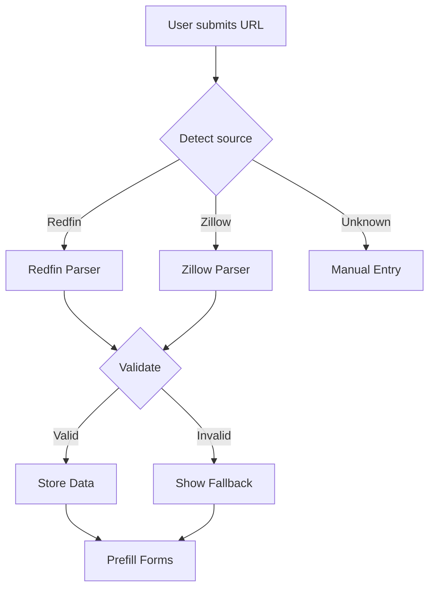

# Smart Import Advanced Flow

## Overview

The Smart Import Advanced Flow extends PropInfera's property import capabilities beyond basic Redfin URL parsing, implementing a robust multi-source import system with intelligent fallback mechanisms and future AI integration.

### Purpose
- Enable multi-source property data import
- Provide resilient import mechanisms
- Ensure data accuracy and completeness
- Support future AI-assisted imports

### Evolution
1. Phase 1 (Basic)
   - Single source (Redfin)
   - Basic URL parsing
   - Manual fallback

2. Phase 2 (Advanced)
   - Multi-source support
   - Smart fallback
   - Session storage
   - Real-time validation

3. Phase 3 (AI-Enhanced)
   - AI field completion
   - Smart validation
   - Cross-source data merging
   - Historical data analysis

### Target Sources
1. Current
   - Redfin (Primary)
   - Manual Entry (Fallback)

2. Future
   - Zillow API
   - Realtor.com API
   - MLS Direct
   - Custom Sources

## Architecture

### Protocol Layer
**File:** `/lib/import/smartImport.ts`

#### Core Functions
```typescript
interface ImportSource {
  name: string;
  pattern: RegExp;
  parser: (url: string) => Promise<PropertyData>;
}

interface PropertyData {
  address: string;
  price: number;
  beds: number;
  baths: number;
  sqft: number;
  yearBuilt: number;
  // ... other fields
}

async function detectSource(url: string): Promise<ImportSource> {
  // Source detection logic
}

async function parsePropertyData(
  url: string,
  source: ImportSource
): Promise<PropertyData> {
  // Unified parsing logic
}
```

### Frontend Layer
**File:** `/components/import/SmartImportForm.tsx`

#### Component Implementation
```typescript
interface SmartImportFormProps {
  onImportComplete: (data: PropertyData) => void;
  onImportError: (error: ImportError) => void;
}

const SmartImportForm: React.FC<SmartImportFormProps> = ({
  onImportComplete,
  onImportError
}) => {
  // Form implementation
};
```

### Data Layer
**File:** `/lib/storage/importStorage.ts`

#### Storage Implementation
```typescript
interface ImportSession {
  id: string;
  url: string;
  source: string;
  data: PropertyData;
  status: 'pending' | 'complete' | 'failed';
  timestamp: number;
}

function storeImportSession(session: ImportSession): void {
  // Session storage logic
}
```

## Features

### Multi-Source Import
1. Source Detection
   ```typescript
   const SOURCE_PATTERNS = {
     redfin: /redfin\.com/,
     zillow: /zillow\.com/,
     realtor: /realtor\.com/
   };
   ```

2. Parser Registry
   ```typescript
   const PARSERS = {
     redfin: async (url: string) => {
       // Redfin parsing logic
     },
     zillow: async (url: string) => {
       // Zillow parsing logic
     }
   };
   ```

### Fallback System
1. Validation
   ```typescript
   function validatePropertyData(data: PropertyData): ValidationResult {
     // Field validation logic
   }
   ```

2. Fallback UI
   ```typescript
   const FallbackForm = dynamic(
     () => import('@/components/import/FallbackForm'),
     { ssr: false }
   );
   ```

## Data Flow

### Import Process


### State Management
1. Import State
   - URL validation
   - Source detection
   - Parsing status
   - Data validation

2. Session Storage
   - Temporary data
   - Import history
   - Error logs
   - Recovery points

## Error Handling

### Validation
```typescript
interface ImportError {
  type: 'invalid_url' | 'parse_failed' | 'validation_failed';
  message: string;
  details?: any;
}

function handleImportError(error: ImportError): void {
  // Error handling logic
}
```

### Error Types
| Error Type | Handling |
|------------|----------|
| Invalid URL | Show format guide |
| Parse Failed | Retry + fallback |
| Validation Failed | Highlight issues |
| Source Unsupported | Manual entry |

## Optimization

### Performance
1. Lazy Loading
   ```typescript
   const RedfinParser = dynamic(
     () => import('@/lib/parsers/redfin'),
     { ssr: false }
   );
   ```

2. Caching
   ```typescript
   const parserCache = new Map<string, PropertyData>();
   ```

3. Debouncing
   ```typescript
   const debouncedValidate = useCallback(
     debounce(validateUrl, 300),
     []
   );
   ```

## Future Enhancements

### AI Integration
1. Field Completion
   - Missing data prediction
   - Historical trend analysis
   - Market comparison

2. Smart Validation
   - Anomaly detection
   - Cross-source verification
   - Confidence scoring

### Technical
1. Performance
   - Web Worker parsing
   - Progressive loading
   - Cache optimization

2. Reliability
   - Retry strategies
   - Data recovery
   - Error tracking

## Development Guidelines

### Best Practices
1. Code Organization
   - Modular parsers
   - Clear interfaces
   - Separation of concerns

2. Type Safety
   ```typescript
   type ImportSource = 'redfin' | 'zillow' | 'realtor' | 'manual';
   
   interface ParserConfig {
     source: ImportSource;
     patterns: RegExp[];
     parser: ParserFunction;
     fallback?: ParserFunction;
   }
   ```

3. Testing
   - Parser validation
   - Error handling
   - Performance metrics
   - Edge cases

### Performance
1. Optimization
   - Minimize parsing time
   - Efficient storage
   - Smart caching

2. Monitoring
   - Parse success rates
   - Error frequencies
   - Performance metrics 