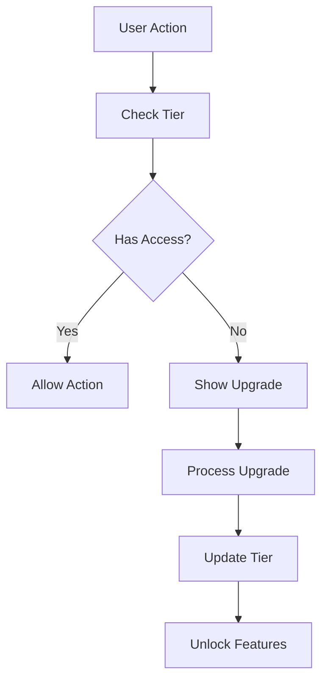

# Tier Management System

## Overview

The Tier Management System controls user access to PropInfera's features based on subscription levels. This document provides a comprehensive technical overview of the system's architecture, implementation, and usage patterns.

### Purpose
- Control feature access by subscription tier
- Manage user upgrade paths
- Enforce usage limits
- Provide clear upgrade incentives

### Value Proposition
1. For Users
   - Clear feature boundaries
   - Transparent upgrade paths
   - Instant access after upgrade
   - Usage tracking

2. For Business
   - Revenue generation
   - Feature monetization
   - Usage analytics
   - Growth tracking

### Supported Tiers
1. Free
   - Basic calculator access
   - Limited saves (5)
   - Standard PDF exports
   - No Smart Import

2. Pro
   - Unlimited saves
   - Smart Import access
   - Premium PDF templates
   - Basic insights

3. Elite
   - All Pro features
   - Advanced insights
   - Custom branding
   - Priority support

## Architecture

### Context Layer
**File:** `/context/TierContext.tsx`

#### Context Implementation
```typescript
interface TierContextType {
  tier: UserTier;
  isPro: boolean;
  isElite: boolean;
  canUseFeature: (feature: FeatureKey) => boolean;
  upgradeTier: (newTier: UserTier) => Promise<void>;
}

const TierContext = createContext<TierContextType>({
  tier: 'free',
  isPro: false,
  isElite: false,
  canUseFeature: () => false,
  upgradeTier: async () => {}
});
```

#### Features
- Tier state management
- Feature access control
- Upgrade handling
- Usage tracking

### Protocol Layer
**File:** `/lib/tier/tierUtils.ts`

#### Core Functions
```typescript
interface TierLimits {
  maxSaves: number;
  canUseSmartImport: boolean;
  canExportPDF: boolean;
  canGenerateInsights: boolean;
}

function getTierLimits(tier: UserTier): TierLimits {
  // Return tier-specific limits
}

function validateFeatureAccess(
  tier: UserTier,
  feature: FeatureKey
): boolean {
  // Validate feature access
}
```

### Data Layer
**File:** `/lib/data/tierData.ts`

#### Database Schema
```typescript
interface UserTierData {
  userId: string;
  tier: UserTier;
  upgradeDate?: Date;
  trialEndDate?: Date;
  features: {
    [key: string]: boolean;
  };
}
```

## Features

### Access Control
1. Feature Gating
   ```typescript
   const featureGates = {
     smartImport: ['pro', 'elite'],
     unlimitedSaves: ['pro', 'elite'],
     premiumPDF: ['pro', 'elite'],
     advancedInsights: ['elite']
   };
   ```

2. Usage Limits
   ```typescript
   const tierLimits = {
     free: {
       maxSaves: 5,
       maxExports: 3,
       maxImports: 0
     },
     pro: {
       maxSaves: Infinity,
       maxExports: Infinity,
       maxImports: 10
     },
     elite: {
       maxSaves: Infinity,
       maxExports: Infinity,
       maxImports: Infinity
     }
   };
   ```

### Upgrade System
1. Upgrade Paths
   ```typescript
   interface UpgradeOption {
     fromTier: UserTier;
     toTier: UserTier;
     price: number;
     features: string[];
   }
   ```

2. Upgrade Flow
   ```typescript
   async function handleUpgrade(
     userId: string,
     newTier: UserTier
   ): Promise<void> {
     // Process payment
     // Update tier
     // Unlock features
   }
   ```

## Data Flow

### Tier Management


### State Updates
1. Tier Changes
   - Context update
   - Feature recalculation
   - UI refresh

2. Usage Tracking
   - Save counts
   - Feature usage
   - Limit checks

## Error Handling

### Validation
```typescript
function validateTier(tier: unknown): UserTier {
  if (!isValidTier(tier)) {
    console.warn('Invalid tier, defaulting to free');
    return 'free';
  }
  return tier as UserTier;
}
```

### Error Types
| Error Type | Handling |
|------------|----------|
| Invalid Tier | Default to free |
| Upgrade Failed | Show error + retry |
| Access Denied | Show upgrade prompt |

## Optimization

### Performance
1. Memoization
   ```typescript
   const tierFeatures = useMemo(() => {
     return calculateFeatures(tier);
   }, [tier]);
   ```

2. Lazy Loading
   ```typescript
   const UpgradeModal = dynamic(
     () => import('@/components/upgrade/UpgradeModal'),
     { ssr: false }
   );
   ```

3. Caching
   ```typescript
   const tierCache = new Map<string, UserTier>();
   ```

## Future Enhancements

### Features
1. Custom Gates
   - Module-specific limits
   - Time-based access
   - Usage quotas

2. Trials
   - Time-limited access
   - Feature previews
   - Auto-downgrade

3. Analytics
   - Usage tracking
   - Upgrade funnels
   - Feature popularity

### Technical
1. Performance
   - Tier preloading
   - Feature caching
   - Optimistic updates

2. Security
   - Tier validation
   - Access logging
   - Audit trails

## Development Guidelines

### Best Practices
1. Code Organization
   - Centralized tier logic
   - Modular feature gates
   - Clear upgrade paths

2. Type Safety
   ```typescript
   type UserTier = 'free' | 'pro' | 'elite';
   type FeatureKey = keyof typeof featureGates;
   
   interface TierConfig {
     limits: TierLimits;
     features: FeatureKey[];
     upgradeOptions: UpgradeOption[];
   }
   ```

3. Testing
   - Tier validation
   - Feature access
   - Upgrade flows
   - Error handling

### Performance
1. Optimization
   - Minimize re-renders
   - Cache tier data
   - Lazy load upgrades

2. Monitoring
   - Tier changes
   - Feature usage
   - Upgrade success 